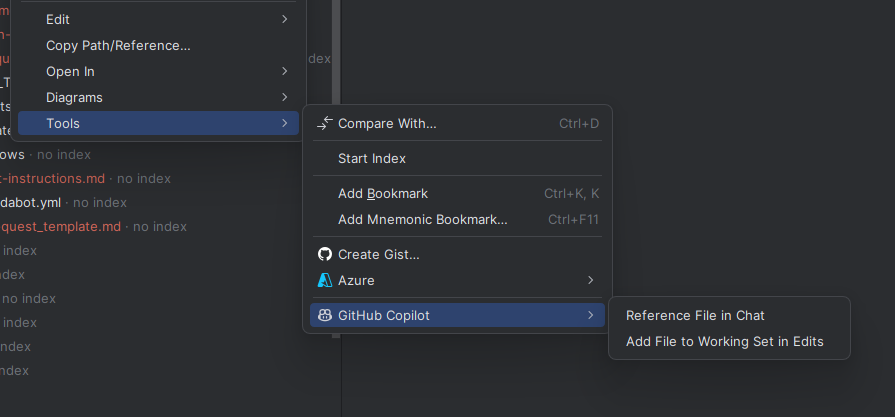

## 🚀 Setting up the AI Assisted Coding Framework in your project

This framework integrates several powerful MCP (Model Context Protocol) tools to supercharge your development workflow:

- **Context7 MCP**: Provides live documentation and code snippet retrieval for authoritative technical references
- **Memory MCP**: Delivers persistent project memory, decision tracking, and knowledge graph capabilities
- **Sequential Thinking MCP**: Assists the LLM with ordering tasks, and breaking down complex ideas
- **Microsoft.Learn MCP**: Give your LLM access to the entire Microsoft Learn knowledgebase!

Together, they transform GitHub Copilot into an intelligent development assistant that remembers project context, tracks architectural decisions, and maintains comprehensive project knowledge across sessions.

## 📋 Prerequisites

- **Node.js 16+** (for MCP tools)
- **Container Platform** An OCI compliant container runtime, such as:
    - [Docker Desktop](https://www.docker.com/products/docker-desktop)
    - [Podman](https://podman.io/) [^1]
- **IDE** with GitHub Copilot[^2]
- **Git** for version control

## 🛠️ Installation & Setup

### Step 1: Clone The Framework Repository
#### Windows Terminal:
```powershell
# Clone this repository
git clone https://github.com/ChrisMcKee1/AI-Assisted-Coding.git
```

We will use the files in this repository once you've setup your local workspace. Keep them somewhere easy to access, we recommend a folder such as `C:\github\` or `~/github` on Linux & OSX.

### Step 2 (optional): Change the MCP Configuration

By default, we utilize the local MCP tools for caching and speed. However, if you don't have NodeJS installed, and do not wish to use NodeJS, you can instead utilize docker versions of each tool. To build and run the Docker version of the the tools, you will need to see the documentation for each to setup the docker config:

See the [Context7 Docker Readme](../../context7-docker.md) for instructions on how to use Docker to host Context7 locally.

See the [Playwright MCP Readme](https://github.com/microsoft/playwright-mcp) for details on advanced configuration and docker support for Playwright.

See the [Sequential Thinking MCP Readme](https://github.com/modelcontextprotocol/servers/tree/main/src/sequentialthinking) for details on how to configure it using docker.

See the [Memory MCP Readme](https://github.com/modelcontextprotocol/servers/tree/main/src/memory) for details on how to configure it using Docker

> [!IMPORTANT] 
> If you intend to do this, please do this before coming to the workshop, and ensure they are setup and configured. This can take time to setup and troubleshoot, so be prepared. Our recommendation is to use the NodeJS versions of the tools.

### Step 3: Clone the eShop Repository

You'll be building this challenge using the popular eShop demo repository from Microsoft. Clone the [eShop](https://github.com/dotnet/eShop/) Repository from the dotnet team to an easy to access location on your machine.

### Step 4: Copy the Framework to the eShop repository

Copy the `.github` and `.vscode` folders from the AI-Assisted-Coding repository to the root of your eShop repository. An example script below assumes you cloned both repositories to the root of `C:\github` or `~/github` respectively.

#### Powershell
```powershell
cd c:\github\AI-Assisted-Coding
robocopy . "C:\github\eShop" /E /XD .git
```

#### Bash
```bash
cd ~/github
rsync -av --exclude='.git' . ~/github/eShop
```


### Step 5: Run the Analyze Workflow

Open the eShop Solution using VS Code or your preferrred IDE.

Run the `/analyze-product` prompt in Copilot Agent Mode to analyze your woskpace and generate the documents that help the spec-driven development workflow operate smoothly.

> [!NOTE]
> If you are using Visual Studio 2022, you will need to manually reference custom instruction files. You will need to swap to "folder view" in Visual Studio 2022, and then you can type `#analyze-product.instructions.md` to find and reference the file in the chat window.

> [!NOTE]
> If you are using Jebrains Rider, you will need to manually reference the file by dragging it from the file system window, or by right-clicking, and using the context menu to reference the file in chat.



### Step 6: Verify Framework setup is completed

1. Answer any questions that the AI prompts you with, and wait for it to complete.
2. The framework will automatically generate the `copilot-instructions.md` file
3. The framework should also generate a series of files in a folder named `.docs`
4. Review these documents for accuracy, and fix any problems you see.


### Step 7: Follow the instructions from the `README.md` file to run eShop locally

Follow the instructions in the `README.md` file at the base of the eShop Repository to setup the application locally. You'll want to run the application using Aspire, and Docker, so that you can debug the application. Ensure that you can reach the Blazor Customer Portal, and that you can add an item from the catalog to your cart before you continue.

## Next challenge

Now that you've setup the AI to be able to better understand and work within your repository, it's time to [understand how to write requirements!](./2-requirements.md)

[^1]: For more information, see [Container Runtime](https://learn.microsoft.com/en-us/dotnet/aspire/fundamentals/setup-tooling?tabs=linux%2Cunix&pivots=dotnet-cli#container-runtime)
[^2]: _VS Code supports all features, Visual Studio 2022 17.14.13 and Jetbrains IDEs require workarounds noted through the workshop_