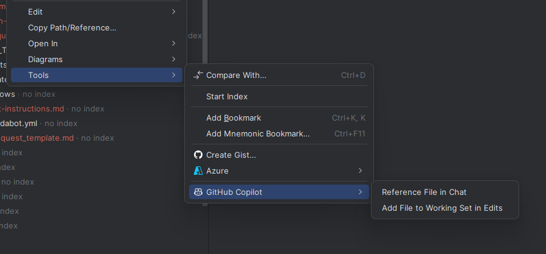

## 🚀 Setting up Spec-Kit in your project

[Spec-Kit](https://github.com/github/spec-kit) brings Spec-Driven Development to your workflow, giving GitHub Copilot structured context through specifications, implementation plans, and task breakdowns — all version-controlled alongside your code.

## 📋 Prerequisites

- **Node.js 16+** (for MCP tools)
- [Python UV](https://docs.astral.sh/uv/)
- [Python 3.11+](https://www.python.org/downloads/)
- **Container Platform** An OCI compliant container runtime, such as:
    - [Docker Desktop](https://www.docker.com/products/docker-desktop)
    - [Podman](https://podman.io/) [^1]
- **IDE** with GitHub Copilot[^2]
- **Git** for version control

## 🛠️ Installation & Setup

### Step 1: Install the Specify CLI

Install Spec-Kit once and use it across all your projects. Pin to the latest stable release for reproducibility:

#### Windows (PowerShell):
```powershell
uv tool install specify-cli --from git+https://github.com/github/spec-kit.git@v0.8.7
```

#### macOS / Linux (Bash):
```bash
uv tool install specify-cli --from git+https://github.com/github/spec-kit.git@v0.8.7
```

Verify the installation:

```bash
specify version
```

> [!TIP]
> Don't have `uv`? Install it first: https://docs.astral.sh/uv/getting-started/installation/

### Step 2 (optional): Change the MCP Configuration

By default, we utilize the local MCP tools for caching and speed. However, if you don't have NodeJS installed, and do not wish to use NodeJS, you can instead utilize docker versions of each tool. To build and run the Docker version of the the tools, you will need to see the documentation for each to setup the docker config:

See the [Context7 Docker Readme](../../context7-docker.md) for instructions on how to use Docker to host Context7 locally.

See the [Playwright MCP Readme](https://github.com/microsoft/playwright-mcp) for details on advanced configuration and docker support for Playwright.

See the [Sequential Thinking MCP Readme](https://github.com/modelcontextprotocol/servers/tree/main/src/sequentialthinking) for details on how to configure it using docker.

See the [Memory MCP Readme](https://github.com/modelcontextprotocol/servers/tree/main/src/memory) for details on how to configure it using Docker

> [!IMPORTANT] 
> If you intend to do this, please do this before coming to the workshop, and ensure they are setup and configured. This can take time to setup and troubleshoot, so be prepared. Our recommendation is to use the NodeJS versions of the tools.

### Step 3: Clone the eShop Repository

You'll be building this challenge using the popular eShop demo repository from Microsoft. Clone the [eShop](https://github.com/dotnet/eShop/) Repository from the dotnet team to an easy to access location on your machine.

### Step 4: Init Spec-Kit in the repo

Next we need to bootstrap the project. Navigate to where you cloned the repo, then run the following:

#### Powershell
```powershell
cd C:\github\eShop
specify init --here --integration copilot
```

#### Bash
```bash
cd ~/github/eShop
specify init --here --integration copilot
```

### Step 5: Establish project principles

Open the eShop Solution using VS Code or your preferred IDE.

Run the `/speckit.constitution` prompt below in Copilot Agent Mode to analyze your workspace and generate the documents that help the spec-driven development workflow operate smoothly.

```text
/speckit.constitution Create principles focused on code quality, testing standards, user experience consistency, and performance requirements. Include governance for how these principles should guide technical decisions and implementation choices.
```

> [!NOTE]
> If you are using Visual Studio 2022 or 2026, use the `#prompts:` shortcut to bring up the prompts. You should be able to reference the specify commands this way. Such as `#prompts:speckit.constitution`

> [!NOTE]
> If you are using Jebrains Rider, you will need to manually reference the file by dragging it from the file system window, or by right-clicking, and using the context menu to reference the file in chat.



### Step 6: Verify Spec-Kit setup is completed

1. Answer any questions that the AI prompts you with, and wait for it to complete.
2. Spec-Kit will automatically generate the `.github/copilot-instructions.md` file
3. Spec-Kit should also generate a series of files in a folder named `.specify`
4. Review these documents for accuracy, and fix any problems you see.


### Step 7: Follow the instructions from the `README.md` file to run eShop locally

Follow the instructions in the `README.md` file at the base of the eShop Repository to setup the application locally. You'll want to run the application using Aspire, and Docker, so that you can debug the application. Ensure that you can reach the Blazor Customer Portal, and that you can add an item from the catalog to your cart before you continue.

## Next challenge

Now that you've setup the AI to be able to better understand and work within your repository, it's time to [understand how to write requirements!](./2-requirements.md)

[^1]: For more information, see [Container Runtime](https://learn.microsoft.com/en-us/dotnet/aspire/fundamentals/setup-tooling?tabs=linux%2Cunix&pivots=dotnet-cli#container-runtime)
[^2]: _VS Code supports all features, Visual Studio 2022 17.14.13 and Jetbrains IDEs require workarounds noted through the workshop_
