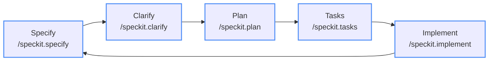

# eShop Feature Development Challenge

## 🎯 Challenge Overview

Your mission is to **design and document a new feature** for the eShop reference application. This challenge will teach you how to write comprehensive feature requirements using the Spec-Kit Spec-Driven Development workflow.

## 📋 What You'll Learn

- How to analyze existing architecture before proposing new features
- Writing clear, actionable feature requirements
- Documenting technical decisions and trade-offs
- Creating implementation roadmaps that align with microservices patterns
- Using Spec-Kit to track and evolve feature development

## 🏗️ Architecture Context

Before you begin, familiarize yourself with the existing eShop architecture by reviewing:

- **Specify Templates**: At this stage, your spec-kit folder contents should resemble the following

```text
└── .specify
    ├── memory
    │ └── constitution.md
    ├── scripts
    │ ├── check-prerequisites.sh
    │ └── common.sh
    ├── specs
    └── templates
        ├── plan-template.md
        ├── spec-template.md
        └── tasks-template.md
```

- **Current Services**: Identity, Catalog, Basket, Ordering, Webhooks, Mobile.BFF
- **Technology Stack**: .NET 9, Aspire, PostgreSQL, Redis, RabbitMQ, Blazor

## 🎲 Feature Ideas (Choose One or Create Your Own)

### 💡 **Beginner Level**
- **Product Reviews & Ratings**: Allow customers to review and rate products
- **Wishlist Management**: Save products for later purchase
- **Product Recommendations**: "Customers who bought this also bought..."

### 🔥 **Intermediate Level**
- **Inventory Management**: Real-time stock tracking with low-stock alerts
- **Advanced Search**: Faceted search with filters, sorting, and autocomplete
- **Loyalty Program**: Points-based rewards system with tier benefits

### 🚀 **Advanced Level**
- **Real-time Notifications**: WebSocket-based order status updates
- **Dynamic Pricing Engine**: AI-powered pricing based on demand, inventory, and market conditions

### 🎨 **Your Own Idea**
Create something unique that fits the e-commerce domain and showcases modern software engineering practices.

## 📝 Requirements Generation

Pass your idea with as much detail as you'd like to the `/speckit.specify` prompt. Copilot will generate a `.specify/specs/` folder with a specification detailing what it understands of your requirements. Go through all generated documents, correct any mistakes, add anything it missed, or remove features and functionality you don't want implemented.

  > [!IMPORTANT]
  > Try to be specific! Don't just tell the AI: "add a rewards system", give it details, such as: `create a customer loyalty program where for every $1 spent on the store, the customer earns 10 points. And for each 1,000 points the customer can redeem those points for $10 off their next purchase. Show the customer's point balance on their profile. And show the number of points earned under each item on the product page`

  > [!TIP]
  > Super-pro tip! You can create your requirements in a markdown file and then reference it to the AI in the same way we've referenced other files. We have a sample requirements-template.md file in this repository that has a great starter template to use for feeding detailed requirements to GitHub Copilot! [Check it out!](../../requirements-template.md)

## ✅ Success Criteria

Your feature requirements document should demonstrate:

### 📋 **Requirements Quality**
- [ ] **Clear Problem Definition**: Business need is well-articulated
- [ ] **Testable Acceptance Criteria**: Each requirement can be verified
- [ ] **Complete User Workflows**: End-to-end scenarios are covered
- [ ] **Edge Cases Considered**: Error conditions and failure modes addressed

### 🏗️ **Technical Soundness**
- [ ] **Architectural Alignment**: Fits existing microservices patterns
- [ ] **Service Boundaries**: Clear ownership and responsibilities
- [ ] **Data Consistency**: ACID vs eventual consistency choices justified
- [ ] **Event Design**: Proper domain and integration events identified

### 🔄 **Implementation Realism**
- [ ] **Incremental Delivery**: Broken into deliverable phases
- [ ] **Risk Mitigation**: Known risks identified with mitigation strategies
- [ ] **Testing Strategy**: Comprehensive testing approach outlined
- [ ] **Rollback Plan**: Deployment and rollback strategy considered

### 📈 **Business Value**
- [ ] **Measurable Outcomes**: Success metrics clearly defined
- [ ] **User Impact**: Benefits to different user types identified
- [ ] **Competitive Advantage**: How this differentiates the product
- [ ] **Technical Debt**: Impact on system maintainability considered

## 🚀 Getting Started

1. **Analyze the Architecture**: Spend time understanding the existing system
2. **Choose Your Feature**: Pick something that excites you and fits the domain
3. **Start with Why**: Begin with the business problem and user needs
4. **Design Incrementally**: Build complexity gradually
5. **Think Operations**: Consider monitoring, deployment, and maintenance

## 💡 Pro Tips

### 🎯 **Requirements Writing**
- **Use Active Voice**: "The system shall..." not "The system should probably..."
- **Be Specific**: "Load in under 200ms" not "Load quickly"
- **Include Examples**: Show concrete scenarios
- **Consider Edge Cases**: What happens when things go wrong?

### 🏗️ **Architecture Decisions**
- **Follow Existing Patterns**: Don't reinvent what's working
- **Design for Failure**: What happens when dependencies fail?

## 🎉 Ready to Begin?

Remember: **Good requirements are the foundation of great software**. Take your time to think through the problem space before jumping into solutions. The eShop application is a reference for modern software engineering practices—your feature should exemplify the same level of thoughtfulness and technical excellence.

## Specify → Clarify → Plan → Tasks → Implement

**Once you have a well-defined specification, you can start work!**

### Step 1: Create your spec

Describe your feature in Copilot Agent Mode:

```text
/speckit.specify <describe your feature here with as much detail as possible>
```

### Step 2: Clarify ambiguities (recommended)

Before planning, let Copilot ask clarifying questions about underspecified areas:

```text
/speckit.clarify
```

### Step 3: Create a technical implementation plan

Provide your tech-stack preferences and let Copilot generate an implementation plan:

```text
/speckit.plan The application uses .NET 9 with Aspire. Follow the existing microservices architecture patterns in eShop.
```

### Step 4: Break into tasks

Generate an actionable task list from the implementation plan:

```text
/speckit.tasks
```

### Step 5: Implement

Execute all tasks according to the plan:

```text
/speckit.implement
```

You can also run `/speckit.analyze` after `/speckit.tasks` to validate cross-artifact consistency before coding begins.

From here, Copilot will begin implementing your feature. Ensure you interact with it often — run unit tests, build and validate its progress, and provide feedback. Continue this loop until your feature is complete!



---

*This challenge is designed to simulate real-world feature development while teaching best practices for requirements documentation and architectural thinking. Focus on quality over speed—the goal is learning, not just completion.*

## Tips & Tricks
Check out the [Tips & Tricks](../3-tips.md) for a collection of common challenges and solutions we've faced and solved ourselves using Spec-Kit!
