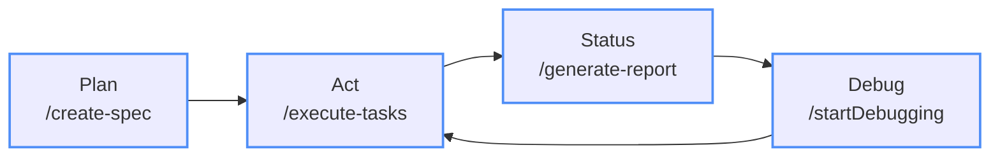

# Spring PetClinic Feature Development Challenge

## 🎯 Challenge Overview

Your mission is to **design and document a new feature** for the PetClinic reference application. This challenge will teach you how to write comprehensive feature requirements that integrate seamlessly with the ConPort workflow and architectural patterns we've created.

## 📋 What You'll Learn

- How to analyze existing architecture before proposing new features
- Writing clear, actionable feature requirements
- Documenting technical decisions and trade-offs
- Creating implementation roadmaps that align with microservices patterns
- Using ConPort to track feature development progress

## 🏗️ Architecture Context

Before you begin, familiarize yourself with the existing PetClinic architecture by reviewing:

- **AI Generated documentation**: `docs/*.md` - Project and Architecture documentation created by GitHub Copilot
- **Current Services**: Identity, Catalog, Basket, Ordering, Webhooks, Mobile.BFF
- **Technology Stack**: .NET 9, Aspire, PostgreSQL, Redis, RabbitMQ, Blazor

## 🎲 Feature Ideas (Choose One or Create Your Own)

### 💡 **Beginner Level**
- **Pet Profile**: Add the ability to upload a photo for a customer's pet

### 🔥 **Intermediate Level**
- **Veterinarian Schedule**: Veterinarian appointment schedule view
- **Loyalty Program**: Points-based rewards system with tier benefits

### 🚀 **Advanced Level**
- **Real-time Notifications**: Notify the customer using SMS when their next appointment is!

### 🎨 **Your Own Idea**
Create something unique that fits the veterinarian domain and showcases modern software engineering practices.

## 📝 Requirements Generation

Pass your idea with as much detail as you'd like to the `/create-spec` prompt. The AI will then generate a `.docs/specs` folder, with a specification detailing what it understands of your requirements. You will want to go through all of these documents, and correct any mistakes, add anything it missed, or take off features and functionality you don't want it to implement.

  > [!IMPORTANT]
  > Try to be specific! Don't just tell the AI: "add a rewards system", give it details, such as: `create a customer loyalty program where for every $1 spent on services, the customer earns 10 points. And for each 1,000 points the customer can redeem those points for $10 off their next visit. Show the customer's point balance on their profile. And show the number of points earned under each visit in their pet's record`

  > [!TIP]
  > Super-pro tip! You can create your requirements in a markdown file and then reference it to the AI in the same way we've referenced other files. We have a sample requirements-template.md file in this repository that has a great starter template to use for feeding detailed requirements to GitHub Copilot! [Check it out!](../../requirements-template.md)

## ✅ Success Criteria

Your feature requirements document should demonstrate:

### 📋 **Requirements Quality**
- [ ] **Clear Problem Definition**: Business need is well-articulated
- [ ] **Testable Acceptance Criteria**: Each requirement can be verified
- [ ] **Complete User Workflows**: End-to-end scenarios are covered
- [ ] **Edge Cases Considered**: Error conditions and failure modes addressed

### 🏗️ **Technical Soundness**
- [ ] **Architectural Alignment**: Fits existing microservices patterns
- [ ] **Service Boundaries**: Clear ownership and responsibilities
- [ ] **Data Consistency**: ACID vs eventual consistency choices justified
- [ ] **Event Design**: Proper domain and integration events identified

### 🔄 **Implementation Realism**
- [ ] **Incremental Delivery**: Broken into deliverable phases
- [ ] **Risk Mitigation**: Known risks identified with mitigation strategies
- [ ] **Testing Strategy**: Comprehensive testing approach outlined
- [ ] **Rollback Plan**: Deployment and rollback strategy considered

### 📈 **Business Value**
- [ ] **Measurable Outcomes**: Success metrics clearly defined
- [ ] **User Impact**: Benefits to different user types identified
- [ ] **Competitive Advantage**: How this differentiates the product
- [ ] **Technical Debt**: Impact on system maintainability considered

## 🚀 Getting Started

1. **Analyze the Architecture**: Spend time understanding the existing system
2. **Choose Your Feature**: Pick something that excites you and fits the domain
3. **Start with Why**: Begin with the business problem and user needs
4. **Design Incrementally**: Build complexity gradually
5. **Think Operations**: Consider monitoring, deployment, and maintenance
6. **Document Decisions**: Use ConPort to track your reasoning

## 💡 Pro Tips

### 🎯 **Requirements Writing**
- **Use Active Voice**: "The system shall..." not "The system should probably..."
- **Be Specific**: "Load in under 200ms" not "Load quickly"
- **Include Examples**: Show concrete scenarios
- **Consider Edge Cases**: What happens when things go wrong?

### 🏗️ **Architecture Decisions**
- **Follow Existing Patterns**: Don't reinvent what's working
- **Design for Failure**: What happens when dependencies fail?

## 🎉 Ready to Begin?

Remember: **Good requirements are the foundation of great software**. Take your time to think through the problem space before jumping into solutions. The PetClinic application is a reference for modern software engineering practices—your feature should exemplify the same level of thoughtfulness and technical excellence.

**Once you have a well defined specification, you can start work!**

When you're created your specs, prompt Copilot in Agent Mode:

`/execute-tasks`

You can pass it alone, or reference the specific task id from the `tasks.md` file you'd like to start with. Remember to help the AI keep track of completed tasks, so that you can easily start new conversations as context windows fill up. You can have the AI pickup on a specific task id, and sub-task with the same command:

`/execute-task Resume 03bd0240-fdcc-48a9-832c-71c44193a375 task 1.10`

From here, the AI will begin implementing your feature. Ensure you interact with the AI often, running unit tests, building and validating it's progress, provide feedback. Continue to use this process as you go until your feature is completed!

---

*This challenge is designed to simulate real-world feature development while teaching best practices for requirements documentation and architectural thinking. Focus on quality over speed—the goal is learning, not just completion.*

## Tips & Tricks
Check out the [Tips & Tricks](../3-tips.md) for a collection of common challenges and solutions we've faced and solved ourselves using this framework!