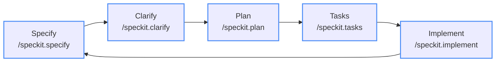

# Spring PetClinic Feature Development Challenge

## Challenge Overview

Your mission is to **design and document a new feature** for the PetClinic reference application using the Spec-Kit Spec-Driven Development workflow.

## What You'll Learn

- How to analyze existing architecture before proposing new features
- Writing clear, actionable feature requirements
- Documenting technical decisions and trade-offs
- Creating implementation roadmaps that align with existing patterns
- Using Spec-Kit to track and evolve feature development

## Architecture Context

Before you begin, review:

- **Spec-Kit documentation**: `.specify/memory/constitution.md` — your project governing principles
- **Areas**: Models, Owner, Vet, and System namespaces, along with the resources folder templates
- **Technology Stack**: Java 17, Spring Boot 3.5, Maven build. Thymeleaf View. Spring Data JPA with H2. Caffeine caching. JUnit 5 and Spring Boot Test.

## Feature Ideas (Choose One or Create Your Own)

### Beginner Level
- **Pet Profile**: Add the ability to upload a photo for a customer's pet
- **Pet Age Calculator**: Calculate and show intelligent pet age (e.g., "1 year, 6 months") from birthday
- **Visit Notes Enhancement**: Add rich text description field for visit notes with character counter
- **Owner Email Field**: Add optional email field to owner contact information with validation
- **Pet Weight Tracking**: Add weight field to pet profile with optional unit selection (lbs/kg)
- **Visit Cost Display**: Add read-only cost field to visits for billing reference
- **Vet Availability Status**: Add "Available/Busy" status indicator on vet list page
- **Search Enhancement**: Add search by phone number on the find owners page

### Intermediate Level
- **Veterinarian Schedule**: Veterinarian appointment schedule view
- **Loyalty Program**: Points-based rewards system with tier benefits
- **Pet Medical History**: Comprehensive medical records with vaccination tracking
- **Appointment Reminders**: Email reminder system for upcoming visits
- **Owner Dashboard**: Personalized dashboard showing pet health summaries and upcoming appointments
- **Vet Specialization Search**: Filter and search veterinarians by their specialties
- **Online Appointment Booking**: Public-facing booking system with available time slots

### Advanced Level
- **Real-time Notifications**: Notify customers via SMS when appointment is within 24 hours (Azure Communication Services)
- **Microservice Architecture**: Split application into separate services (owners, appointments, billing) with API gateway
- **Advanced Analytics Dashboard**: Business intelligence with charts and predictive analytics using Chart.js
- **AI-Powered Health Insights**: Integration with veterinary AI services for health recommendations

### Your Own Idea
Create something unique that fits the veterinarian domain and showcases modern software engineering practices.

## Requirements Generation

Pass your idea to the `/speckit.specify` prompt. Copilot will generate a `.specify/specs/` folder with a specification. Review all generated documents and correct any mistakes or missing details.

  > [!IMPORTANT]
  > Try to be specific! Don't just say "add a loyalty system" — give details, such as: `create a customer loyalty program where for every $1 spent on services, the customer earns 10 points. For each 1,000 points the customer can redeem $10 off their next visit. Show the point balance on their profile and under each visit in the pet's record.`

  > [!TIP]
  > Super-pro tip! Create your requirements in a markdown file and reference it in chat. See the sample [requirements-template.md](../../requirements-template.md) for a great starter template!

## Success Criteria

### Requirements Quality
- [ ] **Clear Problem Definition**: Business need is well-articulated
- [ ] **Testable Acceptance Criteria**: Each requirement can be verified
- [ ] **Complete User Workflows**: End-to-end scenarios are covered
- [ ] **Edge Cases Considered**: Error conditions and failure modes addressed

### Technical Soundness
- [ ] **Architectural Alignment**: Fits existing patterns
- [ ] **Service Boundaries**: Clear ownership and responsibilities
- [ ] **Data Consistency**: ACID vs eventual consistency choices justified
- [ ] **Event Design**: Proper domain and integration events identified

### Implementation Realism
- [ ] **Incremental Delivery**: Broken into deliverable phases
- [ ] **Risk Mitigation**: Known risks identified with mitigation strategies
- [ ] **Testing Strategy**: Comprehensive testing approach outlined
- [ ] **Rollback Plan**: Deployment and rollback strategy considered

### Business Value
- [ ] **Measurable Outcomes**: Success metrics clearly defined
- [ ] **User Impact**: Benefits to different user types identified
- [ ] **Competitive Advantage**: How this differentiates the product
- [ ] **Technical Debt**: Impact on system maintainability considered

## Getting Started

1. **Analyze the Architecture**: Spend time understanding the existing system
2. **Choose Your Feature**: Pick something that excites you and fits the domain
3. **Start with Why**: Begin with the business problem and user needs
4. **Design Incrementally**: Build complexity gradually
5. **Think Operations**: Consider monitoring, deployment, and maintenance

## Pro Tips

### Requirements Writing
- **Use Active Voice**: "The system shall..." not "The system should probably..."
- **Be Specific**: "Load in under 200ms" not "Load quickly"
- **Include Examples**: Show concrete scenarios
- **Consider Edge Cases**: What happens when things go wrong?

### Architecture Decisions
- **Follow Existing Patterns**: Don't reinvent what's working
- **Design for Failure**: What happens when dependencies fail?

## Ready to Begin?

**Good requirements are the foundation of great software.** The PetClinic application is a reference for modern software engineering practices — your feature should exemplify the same thoughtfulness and technical excellence.

## Specify -> Clarify -> Plan -> Tasks -> Implement

**Once you have a well-defined specification, you can start work!**

### Step 1: Create your spec

Describe your feature in Copilot Agent Mode:

```text
/speckit.specify <describe your feature here with as much detail as possible>
```

### Step 2: Clarify ambiguities (recommended)

Before planning, let Copilot ask clarifying questions:

```text
/speckit.clarify
```

### Step 3: Create a technical implementation plan

```text
/speckit.plan The application uses Java 17 with Spring Boot 3.5 and Maven. Follow the existing MVC patterns in PetClinic.
```

### Step 4: Break into tasks

```text
/speckit.tasks
```

### Step 5: Implement

```text
/speckit.implement
```

You can also run `/speckit.analyze` after `/speckit.tasks` to validate cross-artifact consistency before coding begins.

From here, Copilot will begin implementing your feature. Interact often — run unit tests, build and validate progress, provide feedback until your feature is complete!


```mermaid
flowchart LR
  Specify[Specify<br/>/speckit.specify] --> Clarify[Clarify<br/>/speckit.clarify]
  Clarify --> Plan[Plan<br/>/speckit.plan]
  Plan --> Tasks[Tasks<br/>/speckit.tasks]
  Tasks --> Implement[Implement<br/>/speckit.implement]
  Implement --> Specify
  style Specify stroke:#4F8EF7,stroke-width:2px
  style Clarify stroke:#4F8EF7,stroke-width:2px
  style Plan stroke:#4F8EF7,stroke-width:2px
  style Tasks stroke:#4F8EF7,stroke-width:2px
  style Implement stroke:#4F8EF7,stroke-width:2px
```

---

*This challenge simulates real-world feature development while teaching requirements documentation and architectural thinking. Focus on quality over speed.*

## Tips & Tricks
Check out the [Tips & Tricks](../3-tips.md) for common challenges and solutions!
