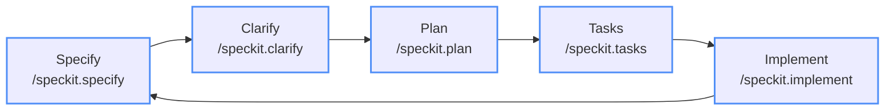

# ngLibrary Feature Development Challenge

## Challenge Overview

Your mission is to **design and document a new feature** for the ngLibrary reference application using the Spec-Kit Spec-Driven Development workflow.

## What You'll Learn

- How to analyze existing architecture before proposing new features
- Writing clear, actionable feature requirements
- Documenting technical decisions and trade-offs
- Creating implementation roadmaps that align with existing patterns
- Using Spec-Kit to track and evolve feature development

## Architecture Context

Before you begin, review:

- **Spec-Kit documentation**: `.specify/memory/constitution.md` — your project governing principles
- **Current Modules**: App, Books, Cart, Checkout, Layouts, Core
- **Technology Stack**: TypeScript 4, Angular 11, Node.js 14-16 compatible

## Feature Ideas (Choose One or Create Your Own)

### Beginner Level
- **GoodReads Library Import**: Import a list of books from a GoodReads export to update available books
- **Replace OpenLibrary Images**: Use Azure Storage (or Azurite emulator) to serve book images instead of OpenLibrary.org
- **Add Series to Book Model**: Add Series name to the book model to support multi-book series
- **Add Book Description**: Add the full description to the fly-out book view

### Intermediate Level
- **Update App to Angular 20**: Update the application and dependencies to Angular 20
- **Inventory Management**: Add a "Library admin" page to add/remove books from inventory
- **Advanced Search**: Faceted search with filters, sorting, and autocomplete
- **User Profile**: Allow users to sign up using OAuth 2.0; track book check-outs against user profile
- **Integrate Hardcover API**: Pull reviews, featured books, and track user checkouts from https://docs.hardcover.app/api/getting-started/
- **Add Author Model**: Create Author model and refactor app to separate Author into its own data model
- **Add Genre Model**: Create Genre model and refactor app to separate Genre into its own data model

### Advanced Level
- **Migrate App to React 18+**: Convert the app to a React v18 app
- **Real-time Notifications**: WebSocket-based book availability updates
- **Native Mobile App**: Use Capacitor or similar to build a PWA mobile app to access the library
- **Book Reviews and Ratings**: Allow customers to review and rate books
- **Book Recommendations**: AI-powered "Customers who read this also read..." with AI-generated reasoning

### Your Own Idea
Create something unique that fits the library management domain and showcases modern software engineering practices.

## Requirements Generation

Pass your idea to the `/speckit.specify` prompt. Copilot will generate a `.specify/specs/` folder with a specification. Review all generated documents and correct any mistakes or missing details.

  > [!IMPORTANT]
  > Try to be specific! Don't just say "add a feature" — give details, such as: `create a customer loyalty program where for every $1 spent, the customer earns 10 points. For each 1,000 points the customer can redeem $10 off their next purchase. Show the point balance on their profile and under each item on the product page.`

  > [!TIP]
  > Super-pro tip! Create your requirements in a markdown file and reference it in chat. See the sample [requirements-template.md](../../requirements-template.md) for a great starter template!

## Success Criteria

### Requirements Quality
- [ ] **Clear Problem Definition**: Business need is well-articulated
- [ ] **Testable Acceptance Criteria**: Each requirement can be verified
- [ ] **Complete User Workflows**: End-to-end scenarios are covered
- [ ] **Edge Cases Considered**: Error conditions and failure modes addressed

### Technical Soundness
- [ ] **Architectural Alignment**: Fits existing patterns
- [ ] **Service Boundaries**: Clear ownership and responsibilities
- [ ] **Data Consistency**: ACID vs eventual consistency choices justified
- [ ] **Event Design**: Proper domain and integration events identified

### Implementation Realism
- [ ] **Incremental Delivery**: Broken into deliverable phases
- [ ] **Risk Mitigation**: Known risks identified with mitigation strategies
- [ ] **Testing Strategy**: Comprehensive testing approach outlined
- [ ] **Rollback Plan**: Deployment and rollback strategy considered

### Business Value
- [ ] **Measurable Outcomes**: Success metrics clearly defined
- [ ] **User Impact**: Benefits to different user types identified
- [ ] **Competitive Advantage**: How this differentiates the product
- [ ] **Technical Debt**: Impact on system maintainability considered

## Getting Started

1. **Analyze the Architecture**: Spend time understanding the existing system
2. **Choose Your Feature**: Pick something that excites you and fits the domain
3. **Start with Why**: Begin with the business problem and user needs
4. **Design Incrementally**: Build complexity gradually
5. **Think Operations**: Consider monitoring, deployment, and maintenance

## Pro Tips

### Requirements Writing
- **Use Active Voice**: "The system shall..." not "The system should probably..."
- **Be Specific**: "Load in under 200ms" not "Load quickly"
- **Include Examples**: Show concrete scenarios
- **Consider Edge Cases**: What happens when things go wrong?

### Architecture Decisions
- **Follow Existing Patterns**: Don't reinvent what's working
- **Design for Failure**: What happens when dependencies fail?

## Ready to Begin?

**Good requirements are the foundation of great software.** The ngLibrary application is a reference for modern software engineering practices — your feature should exemplify the same thoughtfulness and technical excellence.

## Specify -> Clarify -> Plan -> Tasks -> Implement

**Once you have a well-defined specification, you can start work!**

### Step 1: Create your spec

Describe your feature in Copilot Agent Mode:

```text
/speckit.specify <describe your feature here with as much detail as possible>
```

### Step 2: Clarify ambiguities (recommended)

Before planning, let Copilot ask clarifying questions:

```text
/speckit.clarify
```

### Step 3: Create a technical implementation plan

```text
/speckit.plan The application uses TypeScript 4 with Angular. Use vanilla Angular patterns with minimal additional libraries.
```

### Step 4: Break into tasks

```text
/speckit.tasks
```

### Step 5: Implement

```text
/speckit.implement
```

You can also run `/speckit.analyze` after `/speckit.tasks` to validate cross-artifact consistency before coding begins.

From here, Copilot will begin implementing your feature. Interact often — run unit tests, build and validate progress, provide feedback until your feature is complete!



---

*This challenge simulates real-world feature development while teaching requirements documentation and architectural thinking. Focus on quality over speed.*

## Tips & Tricks
Check out the [Tips & Tricks](../3-tips.md) for common challenges and solutions!
